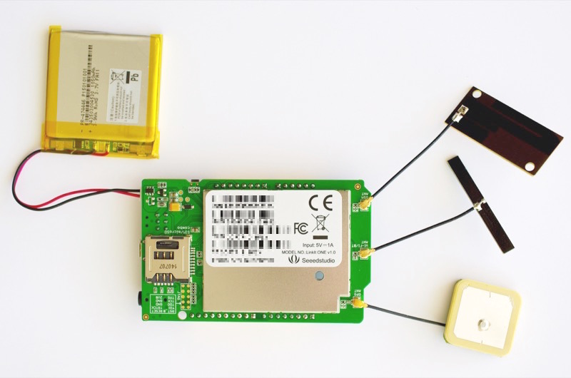
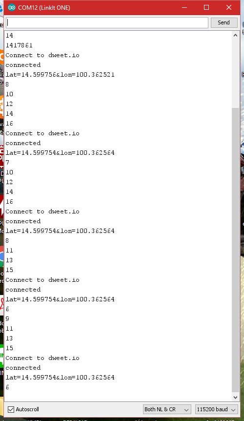

 

# LinkOne_Mycar_Tracker

This's Version 0.1

1.) write data file "gpsdata.txt" to SD Card

2.) send data ( lat , long ) to Dweet.io every 7 sec. 
    (delay per loop use 4 sec. and send data to server use 3 sec.)

 

